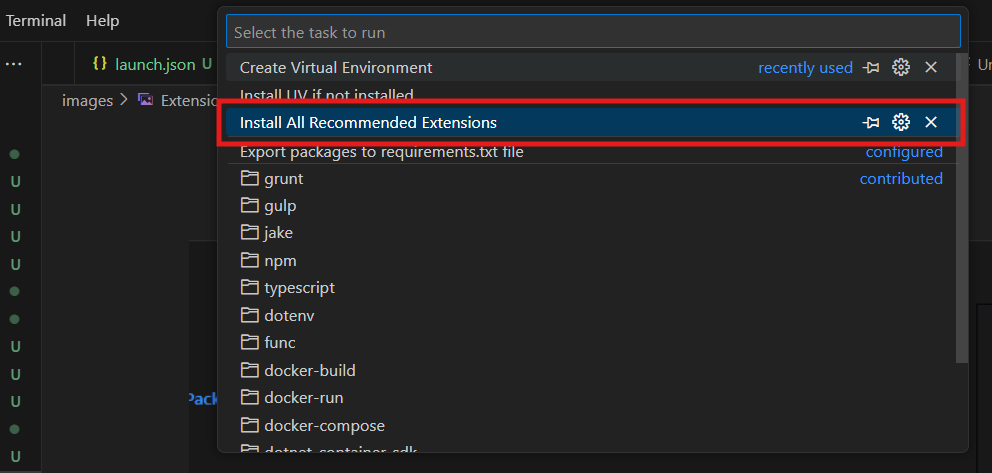

# uvTemplate

Template for easy startups with Projects using VS Code

## Setup Instructions

This template provides automated tasks to help you quickly set up your development environment. Follow the steps below to get started.

### Prerequisites

- VS Code installed on your system
- PowerShell (Windows) or Bash (Linux/macOS)

### Step 1: Install Recommended Extensions

The template includes a task that automatically installs all recommended VS Code extensions for optimal development experience.

**Option 1: Automatic Installation (Recommended)**

- When you open this project in VS Code, the "Install All Recommended Extensions" task runs automatically
- You can see the progress in the terminal



**Option 2: Manual Installation**

- Open the Command Palette (`Ctrl+Shift+P`)
- Type "Tasks: Run Task"
- Select "Install All Recommended Extensions"


### Step 2: Install UV Package Manager

UV is a fast Python package manager that this template uses for dependency management.

**Option 1: Automatic Installation (Recommended)**

- When you open this project in VS Code, the "Install UV if not installed" task runs automatically
- The task will:
  - Check if UV is already installed
  - Download and install UV if not present
  - Add UV to your system PATH
  - Verify the installation


**Option 2: Manual Installation**

- Open the Command Palette (`Ctrl+Shift+P`)
- Type "Tasks: Run Task"
- Select "Install UV if not installed"

### Step 3: Create Virtual Environment

Create and sync your Python virtual environment with all project dependencies.

**To run the task:**

1. Open the Command Palette (`Ctrl+Shift+P`)
2. Type "Tasks: Run Task"
3. Select "Create Virtual Environment"


This task will:

- Create a virtual environment based on your `pyproject.toml`
- Install all dependencies specified in the project
- Sync the environment to ensure consistency


### Step 4: Export Packages to requirements.txt

Generate a `requirements.txt` file from your current environment for compatibility with other tools.

**To run the task:**

1. Open the Command Palette (`Ctrl+Shift+P`)
2. Type "Tasks: Run Task"
3. Select "Export packages to requirements.txt file"

This task will:

- Export all production dependencies (excluding dev dependencies)
- Generate a clean `requirements.txt` file without version hashes
- Save the file in the `app` directory


## Project Structure

```
uvTemplate/
├── app/
│   ├── main.py              # FastAPI application entry point
│   └── src/
│       ├── __init__.py
│       └── endpoint1FileName.py
├── images/                  # Screenshots for documentation
├── .vscode/
│   ├── tasks.json          # VS Code task configurations
│   └── extensions.json     # Recommended extensions
├── pyproject.toml          # Project configuration and dependencies
├── uv.lock                 # Locked dependency versions
└── README.md               # This file
```

## Available Tasks

The following VS Code tasks are available:

1. **Install All Recommended Extensions** - Automatically installs recommended VS Code extensions
2. **Install UV if not installed** - Downloads and installs the UV package manager
3. **Create Virtual Environment** - Creates and syncs the Python virtual environment
4. **Export packages to requirements.txt file** - Generates a requirements.txt file

## Getting Started

1. Open this project in VS Code
2. Wait for the automatic tasks to complete (extensions and UV installation)
3. Run the "Create Virtual Environment" task
4. Start developing!

## Manual Commands

If you prefer using the command line directly:

### Bash/Linux/macOS:

```bash
# Install UV (if not using the task)
curl -LsSf https://astral.sh/uv/install.sh | sh

# Create virtual environment and install dependencies
uv sync

# Export to requirements.txt
uv export --no-hashes --no-dev > requirements.txt
```

### PowerShell/Windows:

```powershell
# Install UV (if not using the task)
Set-ExecutionPolicy RemoteSigned -scope CurrentUser
Invoke-RestMethod https://astral.sh/uv/install.ps1 | Invoke-Expression

# Create virtual environment and install dependencies
uv sync

# Export to requirements.txt
uv export --no-hashes --no-dev > requirements.txt
```

## Running the Application

Once your environment is set up, you can run the FastAPI application:

```bash
# Activate the virtual environment (if needed)
uv run python app/main.py

# Or use uvicorn directly
uv run uvicorn app.main:app --reload
```
